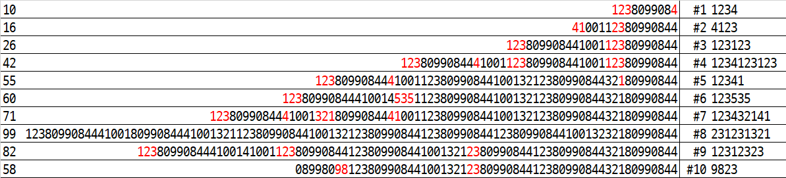

# 1234. 비밀번호 `D3`

> https://swexpertacademy.com/main/code/problem/problemDetail.do?contestProbId=AV14_DEKAJcCFAYD
>

```python
for testcase in range(1, 11):  # 테스트 케이스 10개

    length, num_str = input().split()
    N = int(length)  # 10 ≤ 0~9로 구성된 문자열 길이 ≤ 100
    password = [''] * N  # len(비밀번호) < N
    top = -1

    for n in num_str:
        if n == password[top]:  # pop
            password[top] = ''
            top -= 1
        else:  # push
            top += 1
            password[top] = n

    print(f'#{testcase}', ''.join(password))
```

