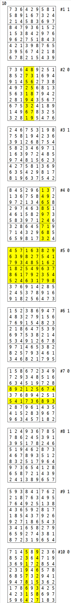

# 1974. 스도쿠 검증 `D3`

> https://swexpertacademy.com/main/code/problem/problemDetail.do?contestProbId=AV5Psz16AYEDFAUq
>

```python
T = int(input())  # 총 테스트 케이스의 개수
for t in range(1, T + 1):

    sudoku = [[0] * 9 for _ in range(9)]
    for _ in range(9):  # 9 x 9 크기의 퍼즐
        sudoku[_] = list(map(int, input().split()))  # 1 이상 9 이하의 정수
    answer = 1  # 겹치는 숫자가 없을 경우, 1을 정답으로 출력하고 그렇지 않을 경우 0 을 출력

    for number in range(1, 10):  # 가로
        for row in range(9):
            if number not in sudoku[row]:
                answer = 0
                break

    if answer:
        for r in range(9):
            for c in range(9):
                if r > c:  # 전치 행렬로
                    sudoku[r][c], sudoku[c][r] = sudoku[c][r], sudoku[r][c]
        for number in range(1, 10):  # 전치 행렬의 가로
            for row in range(9):
                if number not in sudoku[row]:
                    answer = 0
                    break

    if answer:  # 3 x 3 크기의 작은 격자
        for row in range(0, 9, 3):
            if answer:
                for col in range(0, 9, 3):
                    if answer:
                        for number in range(1, 10):
                            c = sudoku[row][col:col + 3] + sudoku[row + 1][col:col + 3] + sudoku[row + 2][col:col + 3]
                            if number not in c:
                                answer = 0
                                break
    print(f'#{t} {answer}')
```

