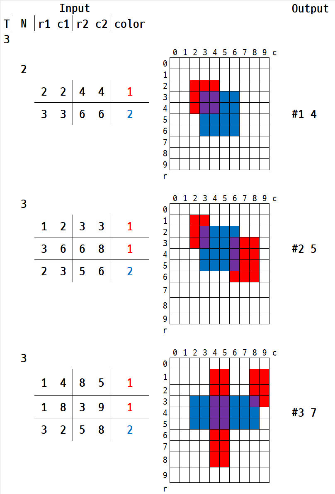

# 4836. 색칠하기 `D2`

> https://swexpertacademy.com/main/learn/course/subjectDetail.do?subjectId=AWOVF-WqqecDFAWg 
>
> 5차시 2일차 - 색칠하기

```python
# 첫 줄에 테스트 케이스 개수 T가 주어진다.   ( 1 ≤ T ≤ 50 )
for testcase in range(1, int(input()) + 1):
    # 그림과 같이 인덱스가 있는 10x10 격자에 빨간색과 파란색을 칠하려고 한다.
    matrix = list([0] * 10 for _ in range(10))
    # 다음 줄부터 테스트케이스의 첫 줄에 칠할 영역의 개수 N이 주어진다. ( 2 ≤ N ≤ 30 )
    for _ in range(int(input())):
        # N개의 영역에 대해 왼쪽 위와 오른쪽 아래 모서리 인덱스, 칠할 색상이 주어질 때,
        # 왼쪽 위 모서리 인덱스 r1, c1, 오른쪽 아래 모서리 r2, c2와 색상 정보 color
        # color = 1 (빨강), color = 2 (파랑)
        r1, c1, r2, c2, color = map(int, input().split())  # ( 0 ≤ r1, c1, r2, c2 ≤ 9 )
        # 주어진 정보에서 같은 색인 영역은 겹치지 않는다. => 다른 색끼리만 겹칠 수 있다
        painting = list([0] * 10 for _ in range(10))
        for outer in range(r1, r2 + 1):
            for inner in range(c1, c2 + 1):
                painting[outer][inner] += color
                matrix[outer][inner] += painting[outer][inner]
    # 칠이 끝난 후 색이 겹쳐 보라색이 된 칸 수를 구하는 프로그램을 만드시오.
    hap = 0
    for outer in range(10):
        for inner in range(10):
            if matrix[outer][inner] == 3:  # 보라(3) = 빨강(1) + 파랑(2)
                hap += 1
    # 각 줄마다 "#T" (T는 테스트 케이스 번호)를 출력한 뒤, 답을 출력한다.
    print(f'#{testcase} {hap}')
```

