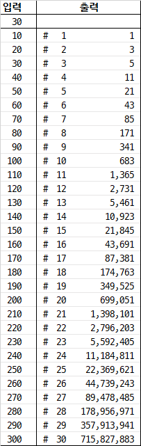

# 4869. 종이붙이기 `D2`

> https://swexpertacademy.com/main/learn/course/subjectDetail.do?subjectId=AWOVHzyqqe8DFAWg
>
> 6차시 4일차 - 종이붙이기	

```python
cases = [0] * 310
cases[10] = 1  # 20x10x1 세로
cases[20] = 3  # 20x10x2 세로 and 20x10x2 가로 and 20x20x1
for n in range(30, 310, 10):  # DP - Tabulation - BottomUp / Memoization
    cases[n] = cases[n - 10] + cases[n - 20] * 2  # 점화식

T = int(input())  # 테스트 케이스 개수 1≤T≤50
for testcase in range(1, T + 1):
    N = int(input())  # 10≤N≤300, N은 10의 배수
    print(f'#{testcase} {cases[N]}')
```

