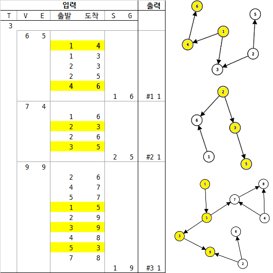

# 4871. 그래프 경로 `D2`

> https://swexpertacademy.com/main/learn/course/subjectDetail.do?subjectId=AWOVHzyqqe8DFAWg
>
> 8차시 4일차 - 그래프 경로

```python
T = int(input())  # 테스트 케이스 개수 1≤T≤50
for testcase in range(1, T + 1):

    V, E = map(int, input().split())  # 5 ≤ V ≤ 50, 4 ≤ E ≤ 1000
    # V개 이내의 노드를 E개의 간선으로 연결한 방향성 그래프에 대한 정보가 주어질 때,
    directed = [[0] * (V + 1) for _ in range(V + 1)]
    for _ in range(E):  # E개의 줄에 걸쳐, 출발 도착 노드로 간선 정보가 주어진다.
        source, target = map(int, input().split())
        directed[source][target] = 1

    while 1:  # 특정한 두 개의 노드에 경로가 존재하는지 확인
        changed = False  # 경로 추가 Loop, 권장하는 방법은 DFS
        for source in range(1, V + 1):
            for bridge in range(1, V + 1):
                if directed[source][bridge]:
                    for target in range(1, V + 1):
                        if directed[bridge][target] and not directed[source][target]:
                            directed[source][target] = 1
                            changed = True
        if not changed:
            break  # 더는 경로가 추가되지 않음

    S, G = map(int, input().split())  # 출발 노드와 도착노드
    if directed[S][G]:
        answer = 1
    else:  # 두 개의 노드에 대해 경로가 있으면 1, 없으면 0을 출력한다.
        answer = 0
    print(f'#{testcase} {answer}')
```

