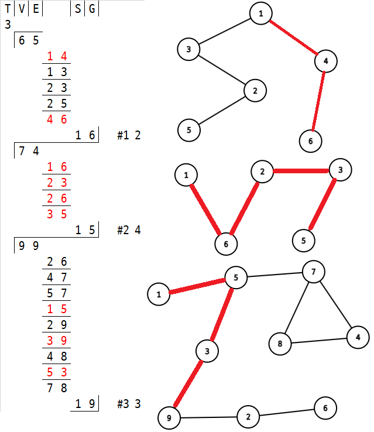

# 5102. 노드의 거리 `D2`

> https://swexpertacademy.com/main/learn/course/subjectDetail.do?subjectId=AWOVIoJqqfYDFAWg
>
> 8차시 6일차 - 노드의 거리

```python
import sys

sys.stdin = open('./sample_input.txt')


def bfs(source, target):  # Source, Target
    visited = [0] * (V + 1)
    queue = list()
    queue.append(source)  # enQueue
    visited[source] = 1
    while queue:
        source = queue.pop(0)  # deQueue
        for gateway in undirected[source]:
            if not visited[gateway]:
                queue.append(gateway)
                visited[gateway] = visited[source] + 1
                if gateway == target:  # 출발 노드에서 도착 노드에 갈 수 있는지
                    return visited[target] - 1  # 최소 몇 개의 간선을 지나면
    return 0  # S와 G가 서로 연결되어 있지 않다면, 0을 출력한다.


T = int(input())
for tcn in range(1, T + 1):

    V, E = map(int, input().split())  # Vertex, Edge
    undirected = [[] for _ in range(V + 1)]
    for _ in range(E):
        s, t = map(int, input().split())
        undirected[s].append(t)
        undirected[t].append(s)
    S, G = map(int, input().split())  # Source, Target
    print(f'#{tcn} {bfs(S, G)}')

```

