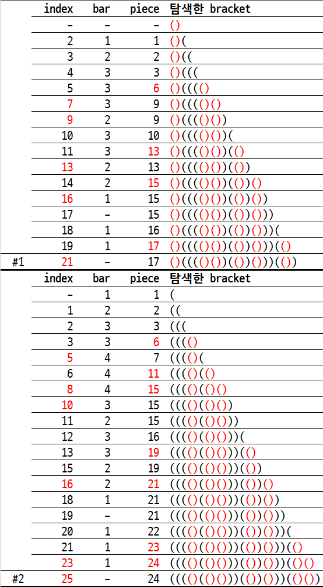

# 5432. 쇠막대기 자르기 `D4`

> https://swexpertacademy.com/main/code/problem/problemDetail.do?contestProbId=AWVl47b6DGMDFAXm
>

```python
T = int(input())  # 테스트 케이스의 수
for testcase in range(1, T + 1):

    bracket = input()  # 쇠막대기와 레이저의 배치를 나타내는 괄호 표현
    length = len(bracket)  # 괄호 문자의 개수 <= 100,000

    i = bar = piece = 0  # 0 <= index, 쇠막대기 개수, 잘려진 쇠막대기 조각의 총 개수

    while i < length:  # 0 <= i <= length - 1

        if bracket[i] == '(':
            if bracket[i + 1] == ')':  # '()' 레이저
                piece += bar  # 쇠막대기를 자름
                i += 2  # index 가 레이저를 넘어감

            else:  # '(('
                bar += 1  # 쇠막대기가 1개 늘어남
                piece += 1  # 쇠막대기 조각의 총 개수도 1개 늘어남
                i += 1

        else:  # ')'
            bar -= 1  # 쇠막대기 1개가 왼쪽에서 끝남
            i += 1

    print(f'#{testcase} {piece}')
```

