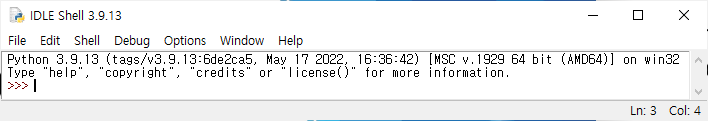

# Python basic

* 프로그래밍은 프로그램이라는 명령을 만들어, 컴퓨터에게 일을 시키는 행위입니다.
* .py로 알려있는 파이썬 소스 코드를 인터프리터(번역기)를 이용해 기계어로 번역합니다.
  * 통째로 기계어로 바꾸는 것이 아니라, 통역하듯이 1줄씩 변환 실행하는 것입니다.

--- 

## Python Development Environment

 

* **IDLE**은 Python을 설치하면 기본적으로 제공됩니다. 코드를 한줄씩 실행해볼 수 있습니다.
* **IDE**는 대표적으로 [PyCharm](https://www.jetbrains.com/ko-kr/pycharm/)과 [Visual Studio Code](https://code.visualstudio.com/)가 있습니다.
* [Jupyter Notebook](https://jupyter.org/)은 python에서 설치 후 웹에서 실행가능합니다.

---

## Python 문법

> [PEP 8 - Style Guide for Python Code](https://peps.python.org/pep-0008/)

* 들여쓰기에 공백을 4칸 쓰며, 주석은 #를 이용합니다.

* **할당 연산자 =** 좌변에 우변을 할당합니다.
  
  > `a = b = 10`       # a는 10, b는 10
  
  > `a, b = 20, 30`   # a는 20, b는 30
  
  > `a, b = b, a`    # a, b를 교환합니다. 임시변수가 필요없습니다.

---

## Datatype

* float point(부동 소수점) rounding error
  * 컴퓨터가 2진수를 쓰기 때문에 정확히 처리 못할 수 있습니다.

> ```python
> import math # 단, Python 3.5 >=
> math.isclose(a, b) # 실수 값 비교
> ```

* f-strings # 단, Python 3.6 >=
  
  > `print(f'Hello, {변수명}!')` # 변수명 값이 들어간 형태로 출력

* **None** 타입은 값이 없음을 표현합니다.
  
### Boolean

* Falsy : False로 취급되는 값들
  
  * ex) 0, (), [], {}, None, "" 

* 단축 평가
  
  * 결과가 이미 나온 경우 확인중인 값 return
  * **and 연산**에서 첫 값이 False면, 첫 값 return
  * **or 연산**에서 첫 값이 True면, 첫 값 return

---

## 컨테이너

* 서로 다른 자료형을 여러 개 담을 수 있는 객체
  
  * ex) list, tuple, range 및 set, dictionary
    
### list

* mutable하며 순서가 있는 시퀀스로 index로 접근
  
  * list_name[index]
    
### tuple

* immutable하며 순서가 있는 시퀀스
  
  * tuple_name[index]
  
  * ex) a, b = (1, 2)
  
  * 주의사항: 마지막 항목에 쉼표 권장
    
    * ex) tuple_name = (1, 2, )
      
### range
      
      > `range(n, m, s)` # n 이상 m 미만까지 s씩 증가하는 시퀀스
      
### 시퀀스 Slicing
      
      > `sequence_name[n, m, s]` # n 이상 m 미만 index, 간격은 s 시퀀스

### Set

* 순서가 없으며 mutable, 집합 연산 가능, 중복 없음
  
  * ex) set_name{1, 2, 3, 4}

* |는 합집합, &는 교집합, -는 차집합
  
### Dictionary

* key-value쌍이며, **순서가 있음** (단, Python 3.7>=)
  
  ```python
  dict_name{'key1': 'value1', 'key2': 'value2'}
  dict_name.keys() # key들 포함, 리스트 아님
  dict_name.values() # values 포함, 리스트 아님
  dict_name.items() # 튜플꼴로 key-value쌍이 들어있음, 리스트 아님
  ```
### 정리
* **dictionary**: mutable, unordered
* **list**: mutable, sequence
* **range**: immutable, sequence
* **set**: mutable, unordered
* **string**: immutable, sequence
* **tuple**: immutable, sequence

---

## 형변환

* True == 1, False == 0
* int + float => float로 변환
* int('정수 형태 문자열') 변환 가능
* float('float 형식 문자열') 변환 가능
* int, float, list, tuple, dict => str 변환 가능

---

## 프로그램 구성 단위

* **identifier**
  * 예약어를 제외한, 변수, 함수, 클래스 등 다양한 값을 가질 수 있는 이름

* **literal**
  * 값 그 자체 
  
* **expression**
  * 새로운 데이터 **값을 생성**하거나 계산하는 코드 조각, **일부분**
  
* **statement**
  * **특정한 작업을 수행하는 코드 전체**
  * **executable**한 최소한의 코드 단위
    * ex) 문자열 **value** 1개
    * ex) expression